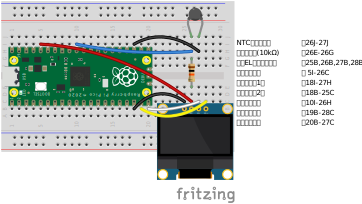

# 1. はじめに
「今日は暑い（気温が高い）」とか、「風邪を引いて熱が出た（体温が高い）」とか、温度は身近な指標として日常的に使われています。地球の気温や海水温が高くなる地球温暖化、そして地球温暖化を含む気候変動に関する話題も毎日のように見聞きします。

身近な指標である温度ですが、そもそも温度とは何でしょうか？ 辞書の説明によれば、

> 暖かさ冷たさの度合を示す数値。物理的には熱平衡を特徴づけ、熱の移動する傾向を表す量。微視的には、系を構成する粒子のもつエネルギーの分布を決め、その平均値の目安となる量。（松村 明・三省堂編修所（編）、「大辞林 第四版」、三省堂、2019年9月）

とあります。最初の文の説明は経験的になんとなく分かるでしょう。2番目の文は、温度が高い方から低い方へ熱が伝わり、同じ温度であれば熱が伝わらないことを意味しています。最後の文の説明はなんだか良くわからないような……簡単に言ってしまうと、物体を構成する原子や分子はバラバラに動いており、温度はそれらのたくさんある原子・分子の運動の激しさの平均値を表している、となります。温度の単位としては、平地で水が凍る温度を0、沸騰する温度を100としてその間を等分割した摂氏温度[°C]と、絶対温度[K]があり、摂氏温度に273.15を足した値が絶対温度となります。

では、温度計はそれらの原子・分子の運動を直接計っているのでしょうか？ 実はそうではありません。温度の変化による物質の性質の変化を測定することで、間接的に温度を計っています。例えば棒状温度計（液柱温度計）は、液体の温度が高くなると膨張し低くなると収縮する性質を利用した温度計で、自分で作成することもできます（「[産総研サイエンスタウン： 手作り温度計にチャレンジ」](https://www.aist.go.jp/science_town/dream_lab/09/)）。ここでは温度計の一つである、サーミスタ温度計を実際に自分で作成し、その測定原理を理解することを目指します。電子工作の入門としても手頃な課題です。

なお、ここではサーミスタ温度計の作成に最低限必要な情報のみ記述しています。より詳細な説明については参考情報として各種ウェブサイトへのリンクを掲載していますので、必要に応じて参照してください。

本内容は「第12回九州大学芸術工学部施設公開」の一企画として実施したものです。電流のオームの法則を使った分圧回路を作成するため中学生以上を想定した企画となっていますが、中学の範囲を超える指数・対数やプログラミングの説明は省略していますので、分からない所は適宜読み飛ばしてください。

# 2. 用意する物
以下の物を使います。リンクは[秋月電子通商](https://akizukidenshi.com/catalog/default.aspx)のオンラインストアの商品ページですが、その他にもオンラインストアでは[Switch Science](https://www.switch-science.com/)、[マルツ](https://www.marutsu.co.jp/)、実店舗では[カホパーツセンター](https://www.kahoparts.co.jp/)（福岡県福岡市中央区）等でも購入できます。

- [Raspberry Pi Pico H](https://akizukidenshi.com/catalog/g/g118085/)（ブレッドボードを使用するのでピンが実装済のHが便利）
- NTCサーミスタ [SEMITEC 103AT-2（最安）](https://akizukidenshi.com/catalog/g/g107258/)、
[SEMITEC 103JT-025（薄型）](https://akizukidenshi.com/catalog/g/g110160/)、[SEMITEC 103AT-11（防水）](https://akizukidenshi.com/catalog/g/g107257/)、等
- [固定抵抗器（10 kΩ）](https://akizukidenshi.com/catalog/g/g125103/)
- [有機ELディスプレイ](https://akizukidenshi.com/catalog/g/g112031/)
- [ブレッドボード](https://akizukidenshi.com/catalog/g/g105294/)
- [ジャンパーワイヤ 6本](https://akizukidenshi.com/catalog/g/g105371/)
- PC（Windows/Mac）
- USBケーブル（片側がMicro USBのもの）

# 3. NTCサーミスタの動作原理
サーミスタとは、温度の変化により電気抵抗が変化する半導体です。その中でも温度が上がると電気抵抗が下がるNTC（Negative Temperature Coefficient）サーミスタを使って温度を測定する方法を説明します。

NTCサーミスタの温度 $T$ [K]と電気抵抗 $R$ [Ω]の関係は[ネイピア数](https://ja.wikipedia.org/wiki/%E3%83%8D%E3%82%A4%E3%83%94%E3%82%A2%E6%95%B0) $e$ の[指数](https://ja.wikipedia.org/wiki/%E5%86%AA%E4%B9%97)を使った次式で表されます。

$$R = R_ae^{\left[B\left(\frac{1}{T}-\frac{1}{T_a}\right)\right]}=R_a\exp\left[B\left(\frac{1}{T}-\frac{1}{T_a}\right)\right] \tag{1}$$

ここで $T_a$ [K] は基準温度、 $R_a$ [Ω] は基準温度 $T_a$ [K] における電気抵抗、 $B$ [K]はB定数と呼ばれる定数です。これらは使用するサーミスタによって異なるので、カタログの数値を確認してください。[「2. 用意する物」](https://github.com/yoichi-kawamoto/thermistor?tab=readme-ov-file#2-%E7%94%A8%E6%84%8F%E3%81%99%E3%82%8B%E7%89%A9)にある[SEMITECのNTCサーミスタ](https://www.semitec.co.jp/products/thermistor_at/)は $T_a$ = 298.15 K、 $R_a$ = 10 kΩ、 $B$ = 3435 Kです。式(1)を[自然対数](https://ja.wikipedia.org/wiki/%E8%87%AA%E7%84%B6%E5%AF%BE%E6%95%B0)の形に書き直すと

$$\ln\left(\frac{R}{R_a}\right)=B\left(\frac{1}{T}-\frac{1}{T_a}\right) \tag{2}$$

となり、更に式を変形すると、温度 $T$ [K] は

$$T=\frac{1}{\frac{\ln\left(\frac{R}{R_a}\right)}{B}+\frac{1}{T_a}} \tag{3}$$

となります。

サーミスタの電気抵抗 $R$ [Ω]を求めるために、下図のように $R_1$ = 10 kΩの固定抵抗器とサーミスタを直列に繋いだ[分圧回路](https://ja.wikipedia.org/wiki/%E5%88%86%E5%9C%A7%E5%9B%9E%E8%B7%AF)を作成します。 $V_{in}$ [V]の電源から出た電流は固定抵抗器を通過すると電圧が $V_{out}$ [V]に降下し、サーミスタを通過してGND（グランド）に到達すると電圧が0.0 Vに降下します。

電圧 $V$ [V]、電流 $I$ [A]、電気抵抗 $R$ [Ω]の間に $I=\frac{V}{R}$ が成り立つのが電流のオームの法則です。固定抵抗器とサーミスタは直列に繋がれているので、固定抵抗器に流れる電流（式(4)の左辺）とサーミスタに流れる電流（式(4)の右辺）は等しくなります。

$$\frac{V_{in}-V_{out}}{R_1}=\frac{V_{out}}{R} \tag{4}$$

式(4)を変形すると、サーミスタの電気抵抗 $R$ [kΩ]は

$$R=R_1\frac{V_{out}}{V_{in}-V_{out}} \tag{5}$$

となります。 $V_{in}$ [V]は電源の電圧で一定ですので、 $V_{out}$ [V]を測定することでサーミスタの電気抵抗を求めることができます。

Raspberry Pi Picoの[ADC（Analog-to-digital converter; A-D変換）](https://ja.wikipedia.org/wiki/%E3%82%A2%E3%83%8A%E3%83%AD%E3%82%B0-%E3%83%87%E3%82%B8%E3%82%BF%E3%83%AB%E5%A4%89%E6%8F%9B%E5%9B%9E%E8%B7%AF)は、電圧を $V_{in}$ = 3.3 Vに対する12bit（2の12乗、0から4095までの4096段階）の相対値として読み取ります（ただし、プログラミングに使うMicroPythonでは12bitから16bit（2の16乗、0から65535までの65536段階）に変換された値となります）。ADCで読み取った値を $n$ とすると、

$$R=R_1\frac{V_{out}}{V_{in}-V_{out}}=R_1\frac{n}{65536-n} \tag{6}$$

となります。この電気抵抗 $R$ [kΩ]を用いて式(3)を計算することで、温度 $T$ [K]が求められます。

$$T=\frac{1}{\frac{\ln\left(\frac{R}{R_a}\right)}{B}+\frac{1}{T_a}}=\frac{1}{\frac{\ln\left(\frac{R}{10.0}\right)}{3435}+\frac{1}{298.15}} \tag{7}$$

# 4. サーミスタ温度計の作成
## 4.1. 回路の作成
はんだ付けをしないで回路を作成するため、ブレッドボードを使用します。例えば下図の1Aから1Eは下部で金属板が繋がっており、ピンやジャンパーワイヤを差し込むことで回路が作成できます。なお、1Aから1E、1Fから1Jの間は溝があり、下部の金属板は繋がっていません。ブレッドボードの詳細は[「「ブレッドボード」ってどう使うの？ – サンハヤト オンラインショップ — サンハヤト 公式オンラインショップ」](https://shop.sunhayato.co.jp/blogs/problem-solving/breadboard)等を確認してください。

先ずブレッドボードにRaspberry Pi Picoを挿しますが、固いのでピンを曲げないように気をつけてください。続いてNTCサーミスタ、固定抵抗器、有機ELディスプレイを下図のようにブレッドボード上に配置し、ジャンパーワイヤで繋ぎます。固定抵抗器の足はブレッドボードの穴の幅に合わせて曲げ、ニッパー等で適当な長さに切ります。下図の右側にそれぞれの部品のブレッドボード上の位置を示しています。

接続は一例です。Raspberry Pi Picoは異なるピンで同じ機能を持つので、異なる繋ぎ方もできます。各ピンの詳細は[Raspberry Pi Pico Pinout（PDFファイル）](https://datasheets.raspberrypi.com/pico/Pico-R3-A4-Pinout.pdf)を確認してください。またRaspberry Pi Picoの互換機を使う場合はそれぞれの機種のピン配列を確認して接続してください。

## 4.2. Raspberry Pi PicoとPCとの接続
[「3. NTCサーミスタの動作原理」](https://github.com/yoichi-kawamoto/thermistor/blob/main/README.md#3-ntc%E3%82%B5%E3%83%BC%E3%83%9F%E3%82%B9%E3%82%BF%E3%81%AE%E5%8E%9F%E7%90%86)で説明したように、Raspberry Pi PicoでA-D変換された電圧（の相対値）を読み取り、NTCサーミスタの電気抵抗を計算し、最終的に温度を計算する必要があります。それらの処理を実行するために、Raspberry Pi Picoにプログラムを書き込む必要があります。プログラミングにはマイクロコントローラ（マイコン）用に最適化されたMicroPythonを使います。マイクロコントローラとは、書き込まれたプログラムを繰り返し実行する簡易なコンピュータです。

PCでのプログラミング、PCとRaspberry Pi Picoとの接続には[Thonny](https://thonny.org/)というソフトウェアを使用するので、OSに対応したインストーラーをダウンロードしてPCにインストールします。インストール時のオプションはデフォルトのままでかまいません。ウェブサイトやインストーラーは英語ですが、Thonnyの初回起動時に言語の選択が出るので、「Language」を「English (US) [default]」から「日本語 [ALPHA]」に変更します。「Initial settings」は「Standard」のままにします。

Raspberry Pi Picoを初めて使う時は、最初に[ファームウェアを書き込む](https://projects.raspberrypi.org/en/projects/getting-started-with-the-pico/3)必要があります。Raspberry Pi Picoの白い「BOOTSEL」ボタンを押したままPCとUSBケーブルで接続するとファームウェアを書き込める状態になるので、Thonnyの右下の「ローカル Python 3 ･ ThonnyのPython」をクリックし「MicroPythonをインストール…」を選択します。「variant」は「Raspberry Pi ･ Pico / Pico H」を選択します。無線LAN機能のあるRaspberry Pi Pico Wや互換機を使う場合には、「variant」は該当する機種を選択します。「variant」を選択すると「version」は最新の安定版が自動で選択されるのでそのままとし、「インストール」をクリックします。Macの場合、MicroPythonのインストールが終わるとRaspberry Pi Picoのマウントが解除されるので、USBケーブルを一度抜き、再度接続します。

MicroPythonがインストールされたRaspberry Pi PicoをPCに接続した状態で、Thonnyの右下の「ローカル Python 3 ･ ThonnyのPython」をクリックし、Windowsの場合は「MicroPython (Raspberry Pi Pico) ･ Board CDC @ COM\*」（\*は環境により異なる数字）、Macの場合は「MicroPython (Raspberry Pi Pico) ･ Board in FS mode @ /dev/cu.usbmodem\*」（\*は環境により異なる数字）を選択します。これでPCでRaspberry Pi Picoを使う準備ができました。

## 4.3. 有機ELディスプレイ用のパッケージインストール
[有機ELディスプレイ](https://micropython-docs-ja.readthedocs.io/ja/latest/esp8266/tutorial/ssd1306.html)は[I2C（Inter-Integrated Circuit、「アイ・スクエアド・シー」と読む）](https://ja.wikipedia.org/wiki/I2C)で接続します。I2C接続は電源（VDD、GND）とクロック（SCL）、データ入出力（SDA）の4本のワイヤを使います。I2Cの詳細は[「I2C _ マイコンとは？ _ エレクトロニクス豆知識 _ ローム株式会社 - ROHM Semiconductor」](https://www.rohm.co.jp/electronics-basics/micon/mi_what7)等を確認してください。

NTCサーミスタは電圧のアナログ信号をA-D変換して読み込みますが、I2Cはデジタル信号であり読み込みは多少複雑になります。その複雑な部分を簡単に利用できるようにするため、予めプログラムされたものがパッケージとして公開されているので、それを利用します。

Thonnyの上部のメニューの「ツール」から「パッケージを管理…」を選択し、検索欄に「ssd1306」と入力して「micropython-lib/PyPiを検索」をクリックします。検索結果の「ssd1306」をクリックし「インストール」をクリックするとパッケージがインストールされます。インストールが終わったら「閉じる」をクリックします。

## 4.4. NTCサーミスタのプログラム書き込みと実行
Thonnyの上部のメニューの「表示」から「ファイル」を選択すると、ウィンドウの左側にファイルタブが表示されます。上部がPC内、下部がRaspberry Pi Pico内のフォルダやファイルが表示されています。この時点でRaspberry Pi Pico内に「lib」フォルダがありますが、ここには[「4.3. 有機ELディスプレイ用のパッケージインストール」](https://github.com/yoichi-kawamoto/thermistor/blob/main/README.md#43-%E6%9C%89%E6%A9%9Fel%E3%83%87%E3%82%A3%E3%82%B9%E3%83%97%E3%83%AC%E3%82%A4%E7%94%A8%E3%81%AE%E3%83%91%E3%83%83%E3%82%B1%E3%83%BC%E3%82%B8%E3%82%A4%E3%83%B3%E3%82%B9%E3%83%88%E3%83%BC%E3%83%AB)でインストールした有機ELディスプレイ用のパッケージがあります。

Raspberry Pi Picoでは、ルートディレクトリ（一番上のフォルダで「/」と表す）に置かれた「main.py」という名前のファイルに記述されたプログラムを自動で実行します。ここでは既にNTCサーミスタ用に書いたプログラムをダウンロードし、Raspberry Pi Picoにコピーします。先ず以下のURLにアクセスし、プログラムが記述されている箇所の右上にあるをクリックすると「main.py」という名前のファイルがダウンロードされます。

https://github.com/yoichi-kawamoto/thermistor/blob/main/main.py

続いてThonnyのファイルタブ上部から、ダウンロードした「main.py」を選択します。通常はダウンロードフォルダにあるので、ファイルタブ上部の「Downloads」をダブルクリックします。「main.py」を見つけたら、右クリックして表示される「/にアップロード」を選択します。これでプログラムがRaspberry Pi Picoのルートディレクトリに「main.py」がコピーされました。ファイルタブ下部のRaspberry Pi Pico内の「main.py」をダブルクリックして開き、上部の緑色のアイコンをクリックしてプログラムを実行すると、Thonnyのシェルタブと有機ELディスプレイに温度と電気抵抗の値が表示されます。これでサーミスタ温度計が作成できました。

PCからRaspberry Pi Picoを取り外す際は、取り出しの操作は必要なく、そのままUSBケーブルを抜きます（Thonnyのシェルタブにエラーメッセージが出ますが問題ありません）。プログラムはRaspberry Pi Pico内に保存されているので、PCに接続しなくても、モバイルバッテリー等に接続すれば温度と電気抵抗を有機ELディスプレイに表示する温度計として使えます。

# 5. 更に理解を深めるには
## 5.1. 電子工作の基本を勉強する
Raspberry Pi Picoは安価なマイコンで、多くのユーザーがいます。インターネット上にもたくさんの情報がありますし、書籍もたくさん出版されています。書籍を一冊通して読めば、電子工作の基本を体系的に学ぶことができます。

- [福田 和宏（著）、「最新Pico W対応！ラズパイPico完全ガイド」、日経BP、2023年3月](https://info.nikkeibp.co.jp/media/RAS/atcl/books/021300015/)
- [そぞら（著）、「ラズパイPico W かんたんIoT電子工作レシピ」、技術評論社、2024年5月](https://gihyo.jp/book/2024/978-4-297-14182-0)
- 等々

また、2021年に発表されたRaspberry Pi Pico以外にも、2005年に発表された[Arduino](https://www.arduino.cc/)も電子工作ではよく使われています。Raspberry Pi Picoは主にMicroPython（Pythonをもとにしている）、Arduinoは主にArduino言語（C言語をもとにしている）でプログラミングをしますので、プログラミング言語の好みで選んでも良いでしょう。

- [福田 和宏（著）、「これ1冊でできる！Arduinoではじめる電子工作 超入門 改訂第6版」、ソーテック社、2024年2月](http://www.sotechsha.co.jp/pc/html/1330.htm)
- 等々

## 5.2. プログラミングを勉強する
ここではNTCサーミスタのプログラムの中身については説明しませんでしたが、プログラム中にコメントを書いているのでそちらを確認してください。

MicroPythonのもととなっているPythonは、多くの分野で使われているプログラミング言語です。Pythonに関する書籍も多く販売されていますが、多すぎて逆に選ぶのが難しいかもしれません。現在では大学のプログラミングの授業ではPythonが使われることが多く、テキストを公開している大学もあります。先ずはこれらで基礎を身につけ、その後に目的に応じた書籍で勉強すると良いでしょう。

- [東京大学 数理・情報教育研究センター、「Pythonプログラミング入門」、東京大学、2023年5月](https://utokyo-ipp.github.io/IPP_textbook.pdf)
- [喜多 一、森村 吉貴、岡本 雅子（著）、「プログラミング演習 Python 2023」、京都大学、2023年10月](https://repository.kulib.kyoto-u.ac.jp/dspace/bitstream/2433/285599/1/Version2023_10_17_01.pdf)

## 5.3. いろいろなセンサーを使ってみる
今回はNTCサーミスタを使って温度計を作成しました。分圧回路を作成し、アナログ信号である電圧をA-D変換により読み取ることで、温度により変化するNTCサーミスタの電気抵抗を求め、温度を計算しました。これはアナログセンサーです。一方、有機ELディスプレイの接続にはデジタル通信のI2Cを使いました。デジタルとは0と1の2進数で表されたデータであり、デジタル信号は電圧の低い状態（Low）と高い状態（High）に二分して0と1の2値を表します。この電圧のLowとHighが高速に切り替わることで、情報を送っています。高精度の温度計や湿度計、二酸化炭素濃度計、距離計、等々、I2C接続のデジタルセンサーがいろいろあります。また、I2C接続以外にもSPI（Serial Peripheral Interface）接続のデジタルセンサー等もあります。測りたいものに応じてセンサーを選び、電子工作をすることで、自分だけの測定器を作ることができます。

- [秋月電子通商で取り扱っているセンサー](https://akizukidenshi.com/catalog/r/rsensor/)
- [Switch Scienceで取り扱っているセンサー](https://www.switch-science.com/collections/%E3%82%BB%E3%83%B3%E3%82%B5)
- [マルツで取り扱っているセンサー](https://www.marutsu.co.jp/categories_15/#goodsClassName2Surround150015)

## 5.4. センサーをIoT化してみる
[IoT（Internet of Things、モノのインターネット）](https://ja.wikipedia.org/wiki/%E3%83%A2%E3%83%8E%E3%81%AE%E3%82%A4%E3%83%B3%E3%82%BF%E3%83%BC%E3%83%8D%E3%83%83%E3%83%88)とは、センサーを含めたいろいろな物がインターネットに接続され、相互に情報をやりとりすることです。Raspberry Pi Pico Wは無線LAN機能を搭載しているので、インターネットに接続することができます。それにより、センサーで計測した値をクラウドに送信することで、例えば外出中に自宅の室温を確認したりできるようになります。センサーデータの送受信やデータをグラフ化するクラウドサービスとして[Ambient](https://ambidata.io/)等があります。